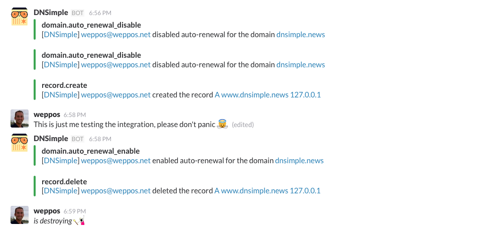
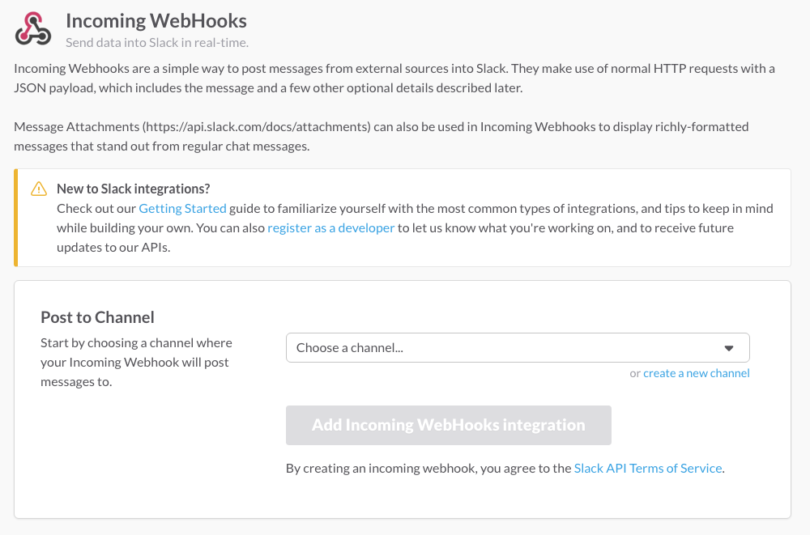

# Strillone

_Strillone_ is a service to publish the events generated from a DNSimple account to a messaging service, using the DNSimple webhooks.

[](https://travis-ci.org/dnsimple/strillone)




## Usage

#### Deploy the application

You can use the following button to deploy the service to Heroku.

[](https://heroku.com/deploy?template=https://github.com/dnsimple/strillone)

#### Check the deploy

Make sure the app is properly deployed. If you access the homepage, you should see a JSON response like the following one:

```json
{"ping":"1458412047","what":"dnsimple-strillone"}
```

#### Configure the Publishers

Configure the target of the messages. We currently support the following publishers:

- [Slack](#slack-configuration)

See below for the specific configurations.

#### Create the webhook

Once you configured the publisher and generated the webhook URL, use the URL to create a new webhook in your DNSimple account.


## Slack configuration

Strillone integrates with Slack using the [Slack Incoming Webhook](https://api.slack.com/incoming-webhooks) feature.

First, you need to [setup an incoming webhook](https://my.slack.com/services/new/incoming-webhook/). Select the Slack channel and follow the instructions.



Once created, Slack will give you a _Webhook URL_ that looks like the following one:


To generate the Strillone webhook URL, simply replace the initial fixed part of the Slack webhook URL with `https://your-strillone-domain.com/slack`.

For instance, if your Heroku app is `https://happy-panda.herokuapp.com/` and the Slack webhook URL is `https://hooks.slack.com/services/XXXXX/YYYYY/ZZZZZZZZZZ`, then your Strillone webhook URL for this specific integration will be:

```
https://your-strillone-domain.com/slack/XXXXX/YYYYY/ZZZZZZZZZZ
```

This is the URL you have to enter in DNSimple when creating the webhook.


## About the name

The word [strillone](https://en.wiktionary.org/wiki/strillone) (literally _someone who shouts a lot_, in practice the equivalent of _newspaper boy_) comes from Italian and it refers to the newspaper sellers in the street, who were used to yell the titles in the front page to catch the attention and sell more newspapers.


Photo: [New York Media](http://nymag.com/daily/intelligencer/2013/06/fed-is-having-a-1936-moment.html)


## License

Copyright (c) 2016-2021 DNSimple Corporation. This is Free Software distributed under the MIT license.
